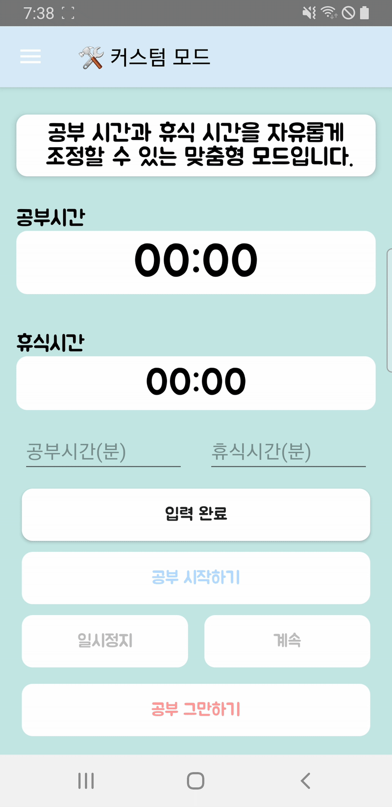

# Project name : FocusPom (Focus🧠 + Pomodoro🍅)

## 프로젝트를 진행 하게된 계기
저는 평소 **포모도로(Pomodoro) 기법**을 활용해 공부하거나 프로젝트를 진행하는 편입니다.
포모도로 기법은 **일정한 시간 동안 집중해서 작업한 뒤 짧은 휴식을 반복하는 방식**으로, 일반적으로 **25분 집중 + 5분 휴식**을 기본 단위로 합니다.

그동안 저는 유튜브에서 포모도로 타이머 영상을 보며 공부했지만, 매번 컨디션에 따라 공부 시간과 휴식 시간을 조절하려 할 때마다 원하는 영상을 찾기가 번거로웠습니다.
또한, 공부가 끝난 후 정확한 공부 시간을 확인하기 어려운 점도 불편했습니다.

이런 불편함을 해결하기 위해, 다양한 공부 모드를 제공하고 사용자가 자유롭게 시간을 설정할 수 있는 **포모도로 앱**을 직접 개발하게 되었습니다.
또한, 공부 시간을 효과적으로 관리할 수 있도록 시각적인 통계를 추가해, 보다 체계적으로 학습할 수 있도록 했습니다.

## 설명
**포모도로 기법**을 활용하여 공부 시간을 효율적으로 관리할 수 있는 애플리케이션입니다.<br>
사용자는 **여러 가지 공부 모드** 중 선택하거나, **커스텀 타이머** 기능을 이용해 자신만의 공부 및 휴식 시간을 설정할 수 있습니다.<br>
또한, **공부 통계 기능**을 통해 하루 동안 공부한 시간과 모드별 누적 공부 시간을 쉽게 확인할 수 있습니다.<br>
<br> <br>

## 기능

- **포모도로 기법**을 활용하여 집중력과 생산성을 극대화할 수 있는 타이머 제공.
- **공부 통계**을 제공하여 오늘 공부한 시간 및 모드별 누적 공부 시간 확인.
- **다양한 공부 모드**:
  - **짧은 집중 모드**: 15분 공부 + 3분 휴식
  - **기본 모드**: 25분 공부 + 5분 휴식
  - **롱 포커스 모드**: 50분 공부 + 10분 휴식
  - **울트라 포커스 모드**: 90분 공부 + 20분 휴식
  - **커스텀 모드**: 원하는 공부 및 휴식 시간 직접 설정 가능.


<br> <br>
## 🛠️ 기술 스택

- **언어 (Languages)**: Kotlin, XML
- **도구 (Tools)**: Android Studio
- **라이브러리 (Libraries)**: Android SDK, Room, ✨[MPAndroidChart](https://github.com/PhilJay/MPAndroidChart)✨

- **기술 적용**:
  - **DrawerLayout** : 사이드 메뉴를 통해 통계 페이지 및 다른 화면으로 쉽게 이동할 수 있도록 네비게이션 구성.
  - **Room** : 로컬 데이터베이스를 활용하여 사용자의 공부 기록 및 통계 저장.
  - **[MPAndroidChart](https://github.com/PhilJay/MPAndroidChart)** : 공부 시간을 효과적으로 분석할 수 있도록 **파이 차트(Pie Chart), 바 차트(Bar Chart), 라인 차트(Line Chart)** 를 활용해 시각화
  - **코루틴 (Coroutines)**: 비동기 작업 최적화
    - `suspend fun`, `withContext`, `launch`를 활용하여 데이터베이스 작업 처리.
<br> <br> <br>

## 📊 MPAndroidChart 

이번 프로젝트에서 가장 신경 쓴 부분은 **공부 데이터를 효과적으로 시각화하는 것**이었습니다.  
이를 위해 **MPAndroidChart** 라이브러리를 활용하여 **파이 차트(Pie Chart), 바 차트(Bar Chart), 라인 차트(Line Chart)** 를 구현하였습니다.

### ✨ 사용한 차트 종류  
- **📌 파이 차트 (Pie Chart)** → 모드별 공부 시간 비율 표시  
- **📌 바 차트 (Bar Chart)** → 각 모드별 총 공부 시간 비교  
- **📌 라인 차트 (Line Chart)** → 요일별 공부 시간 변화 추이  

### 📌 예제 코드 (파이 차트)
```kotlin
private fun setPieChart() {
    val entries = listOf(
        PieEntry(25f, "기본"),
        PieEntry(15f, "짧은 집중"),
        PieEntry(50f, "롱 포커스"),
        PieEntry(90f, "울트라"),
        PieEntry(30f, "커스텀")
    )

    val pieDataSet = PieDataSet(entries, "").apply {
        colors = ColorTemplate.MATERIAL_COLORS.toList()
        valueTextColor = Color.BLACK
        valueTextSize = 16f
        valueFormatter = PercentFormatter(pieChart)
    }

    val pieData = PieData(pieDataSet)

    pieChart.apply {
        data = pieData
        setUsePercentValues(true)
        setEntryLabelColor(Color.BLACK)
        setCenterText("모드별 비율")
        setCenterTextSize(18f)
        description.isEnabled = false
        isRotationEnabled = false
        animateY(1000, Easing.EaseInOutQuad)
    }
}
```
### 📌 예제 코드 (바 차트)
```kotlin
private fun setBarChart() {
    val values = listOf(
        BarEntry(0f, 120f),  // 기본: 2시간
        BarEntry(1f, 75f),   // 롱 포커스: 1시간 15분
        BarEntry(2f, 40f),   // 커스텀
        BarEntry(3f, 25f),   // 짧은 집중
        BarEntry(4f, 90f)    // 울트라
    )

    val labels = listOf("기본", "롱 포커스", "커스텀", "짧은 집중", "울트라")

    val barDataSet = BarDataSet(values, "").apply {
        setColors(ColorTemplate.JOYFUL_COLORS, 250)
        valueTextSize = 14f
        valueFormatter = object : ValueFormatter() {
            override fun getFormattedValue(value: Float): String {
                val h = value.toInt() / 60
                val m = value.toInt() % 60
                return "${h}시간 ${m}분"
            }
        }
    }

    val barData = BarData(barDataSet).apply {
        barWidth = 0.5f
    }

    barChart.apply {
        data = barData
        description.isEnabled = false
        setFitBars(true)
        legend.isEnabled = false
        animateY(1000)

        xAxis.apply {
            valueFormatter = IndexAxisValueFormatter(labels)
            position = XAxis.XAxisPosition.BOTTOM
            granularity = 1f
            textSize = 14f
        }

        axisLeft.isEnabled = false
        axisRight.isEnabled = false
    }
}
```
### 📌 예제 코드 (라인 차트)
```kotlin
private fun setLineChart() {
    val entries = listOf(
        Entry(0f, 90f),
        Entry(1f, 45f),
        Entry(2f, 120f),
        Entry(3f, 60f)
    )
    val labels = listOf("03/28", "03/29", "03/30", "03/31")

    val dataSet = LineDataSet(entries, "공부 시간(분)").apply {
        color = Color.BLUE
        circleRadius = 6f
        lineWidth = 3f
        setDrawValues(true)
        setDrawCircleHole(false)
        setCircleColor(Color.RED)

        // 그래디언트 채우기
        setDrawFilled(true)
        fillDrawable = ContextCompat.getDrawable(context, R.drawable.chart_gradient)

        valueFormatter = object : ValueFormatter() {
            override fun getPointLabel(entry: Entry?): String {
                val total = entry?.y?.toInt() ?: 0
                val h = total / 60
                val m = total % 60
                return "${h}시간 ${m}분"
            }
        }
    }

    val lineData = LineData(dataSet)

    lineChart.apply {
        data = lineData
        description.isEnabled = false
        legend.isEnabled = false
        animateX(1000)

        xAxis.apply {
            position = XAxis.XAxisPosition.BOTTOM
            granularity = 1f
            valueFormatter = IndexAxisValueFormatter(labels)
            textSize = 12f
        }

        axisLeft.setDrawLabels(false)
        axisRight.isEnabled = false
    }
}
```


<br> <br> <br>
## 실행 화면 (Screenshots & GIFs)

<h3>📌 다양한 공부 모드</h3>

<table>
  <tr>
    <th>짧은 집중 모드</th>
    <th>기본 모드</th>
    <th>롱 포커스 모드</th>
    <th>울트라 포커스 모드</th>
    <th>커스텀 모드</th>
  </tr>
  <tr>
    <td></td>
    <td></td>
    <td></td>
    <td></td>
    <td></td>
  </tr>
</table>

<br>
<h3>⏳ 타이머 실행 예시 기본 모드(25분 공부 + 5분 휴식), 커스텀 모드</h3>

<table>
  <tr>
    <th>기본 모드</th>
    <th>커스텀 모드</th>
  </tr>
  <tr>
    <td></td>
    <td></td>
  </tr>
</table>
※ 실행 흐름을 확인할 수 있도록, 실제 앱 실행 장면을 녹화하고 필요 없는 부분을 잘라내어 GIF로 편집했습니다. <br>실제 사용 흐름을 간단하게 보여주기 위한 참고 영상입니다.
<br> <br>

### 📊 공부 통계 화면

  


